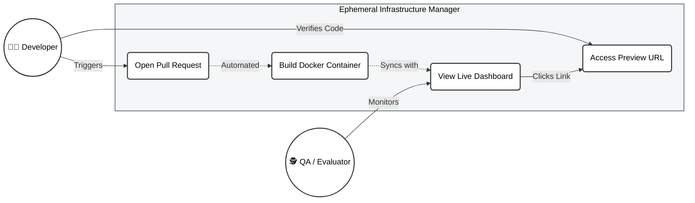

<h1 align="center">☁️ Ephemeral Infrastructure as a Service</h1>

  <strong>An automated Internal Developer Platform (IDP) for dynamic Pull Request preview environments.</strong>

  
  
  
  
  

---

## 📖 Overview

In modern software engineering, traditional shared staging environments create massive deployment bottlenecks. This project solves the "works on my machine" problem by engineering a highly automated, event-driven infrastructure platform. 

Whenever a developer opens a Pull Request, this system automatically intercepts the webhook, securely connects to an AWS cloud environment, and provisions a completely isolated, fully functional preview container. It allows Quality Assurance (QA) teams to test features in parallel with absolute zero downtime to the main production server.

## 🏗️ System Architecture

The platform utilizes a decoupled, cloud-native architecture mapping GitHub events to dynamic Docker allocations.

## ✨ Key Features

- **Automated Provisioning:** GitHub Actions pipeline triggers automatically on `pull_request` events (opened, synchronized, reopened).
- **Strict Isolation:** Every feature branch is containerized via Docker, ensuring 100% environment parity.
- **Dynamic Port Allocation:** Advanced bash scripting calculates mathematical port assignments (`8000 + PR_NUMBER`) to prevent host collisions.
- **Idempotent Deployments:** Safely tears down outdated containers and replaces them with fresh builds upon new commits.
- **Real-Time Orchestrator Dashboard:** A React-based UI that asynchronously polls the Node.js API to visualize active deployments and generate direct hyperlinks to the preview environments.

## 🛠️ Technology Stack

| Domain | Technology | Purpose |
| :--- | :--- | :--- |
| **Cloud Compute** | AWS EC2 (Ubuntu LTS) | Scalable host infrastructure. |
| **Containerization** | Docker Engine | Application isolation and packaging. |
| **Automation** | GitHub Actions | CI/CD pipeline execution and SSH injection. |
| **Backend API** | Node.js & Express | Polling daemon executing `shelljs` commands. |
| **Process Manager**| PM2 | High availability and automated reboot recovery. |
| **Frontend UI** | React & Tailwind CSS | Responsive, real-time control center. |

## ⚙️ How It Works (Under the Hood)

1. **The Trigger:** A developer opens PR `#3`. GitHub fires a webhook to the Actions Runner.
2. **The Pipeline:** The YAML workflow securely SSHs into the AWS EC2 instance using encrypted GitHub Secrets.
3. **The Execution:** The runner executes a bash script that stops any existing container for PR `#3`, builds the new Docker image, and runs it on dynamically calculated Port `8003`.
4. **The State Sync:** The Node.js Orchestrator continuously runs `docker ps`, converting the terminal output into a JSON API response.
5. **The UI Render:** The React Dashboard consumes the API and instantly generates a card with a live URL (`http://<AWS_IP>:8003`) for the QA team.

## 🚀 Future Roadmap & Scalability

As the platform scales toward enterprise-grade operations, the following enhancements are planned:
- **Reverse Proxy Integration:** Implementing Nginx or Traefik with Wildcard DNS to map ports to dynamic subdomains (e.g., `https://pr-3.mycompany.com`).
- **FinOps Optimization:** Adding a cleanup webhook for the `pull_request_closed` event to automatically destroy containers and optimize cloud computing costs.
- **Kubernetes (EKS) Migration:** Transitioning from a single-node Docker setup to a highly available Amazon EKS cluster for multi-AZ redundancy.
